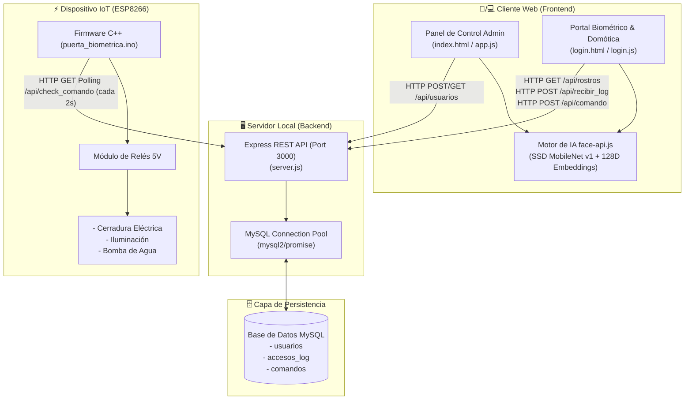
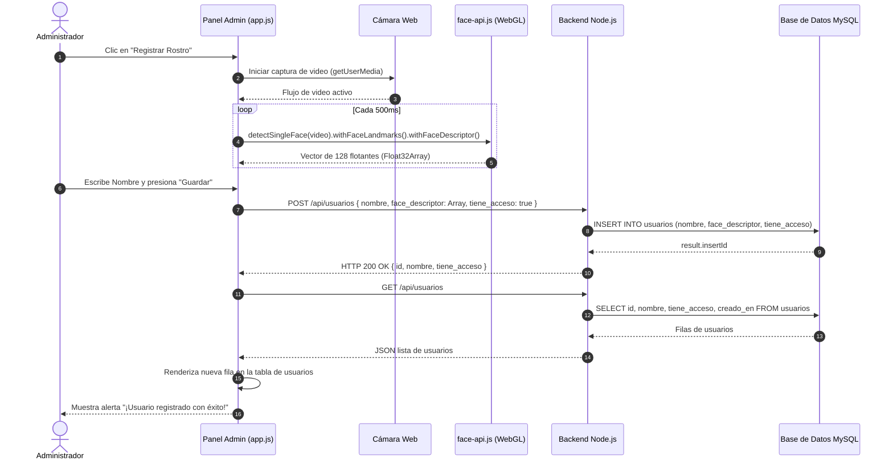
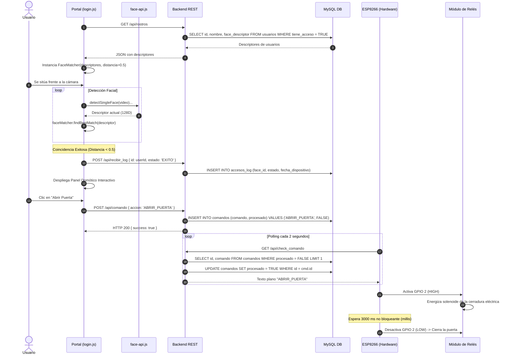

# 🏛️ Documento de Arquitectura de Software y Hardware

**Proyecto:** Sistema de Control de Acceso Biométrico y Domótica IoT  
**Versión:** 1.1.0  
**Fecha:** 2026  

---

## 1. Visión General y Objetivos del Sistema

El sistema implementa una arquitectura híbrida distribuida orientada a la seguridad perimetral y la automatización del hogar (domótica). Su objetivo primordial es permitir el acceso físico autenticado mediante biometría facial sin depender de servicios de computación en la nube ni de GPUs costosas en el servidor, trasladando el procesamiento de inferencia de Visión Artificial al cliente (Browser Edge Computing mediante WebGL/TensorFlow.js) y orquestando actuadores físicos mediante un microcontrolador IoT de bajo coste (ESP8266).

---

## 2. Diagrama de Arquitectura de Alto Nivel (C4 - Nivel de Contenedores)

---

## 3. Descomposición en Capas del Sistema

### 3.1. Capa de Presentación e Inferencia en el Cliente (Frontend)
- **Tecnologías:** HTML5, CSS3 moderno (Glassmorphism, CSS Custom Properties), JavaScript Vanilla ES6+, WebRTC (MediaDevices API), Canvas 2D API, WebGL.
- **Pipeline Biométrico:**
  1. Captura de flujo de video a 30 FPS desde la cámara web (`navigator.mediaDevices.getUserMedia`).
  2. Extracción de fotogramas procesados por el detector SSD MobileNet v1.
  3. Alineación facial mediante 68 puntos de referencia faciales (Face Landmarks).
  4. Reducción dimensional a un vector de 128 flotantes (Embeddings faciales) mediante una red neuronal convolucional residual.
  5. Cálculo de distancia Euclidiana contra la base de datos de descriptores precargados con un umbral de coincidencia estricto ($d \le 0.5$).

### 3.2. Capa de Servicios y Lógica de Negocio (Backend)
- **Tecnologías:** Node.js (v16+), Express.js framework, CORS middleware, body-parser con límite extendido (`limit: '10mb'`).
- **Responsabilidades:**
  - Exposición de endpoints RESTful para la administración de usuarios.
  - Almacenamiento seguro de vectores biométricos en formato JSON serializado.
  - Registro de auditoría de accesos con marcas de tiempo (`NOW()`).
  - Gestión de cola de mensajes tipo FIFO para comandos domóticos hacia los dispositivos embebidos.
  - Servicio estático de archivos web para despliegue sin dependencias externas.

### 3.3. Capa de Persistencia de Datos (MySQL)
- **Tablas:**
  - `usuarios`: Clave primaria autonumérica, nombre, vector facial `LONGTEXT` y flag booleana de habilitación de acceso.
  - `accesos_log`: Historial de intentos de autenticación vinculados a usuarios.
  - `comandos`: Cola de despacho de instrucciones con bandera de estado (`procesado: FALSE/TRUE`).

### 3.4. Capa Embebida e Internet de las Cosas (ESP8266 IoT)
- **Tecnologías:** Microcontrolador ESP8266 Tensilica L106 32-bit, Framework Arduino Core for ESP8266, librerías `ESP8266WiFi`, `ESP8266HTTPClient`, `WiFiManager`.
- **Estrategia de Comunicación:**
  - **Polling HTTP Asíncrono:** Consulta cada 2000 ms (`CHECK_COMANDO_MS`) al endpoint `/api/check_comando`.
  - **Ejecución y Despacho:** Al recibir un comando no vacío (`ABRIR_PUERTA`, `LUCES_ON`, `LUCES_OFF`, `BOMBA_ON`, `BOMBA_OFF`), conmuta el estado de los pines GPIO.
  - **Temporizador de Seguridad por Hardware:** Control de tiempo de apertura de cerradura (3 segundos) mediante variable temporal con función `millis()` sin bloquear el hilo de ejecución principal.

---

## 4. Diagramas de Secuencia e Interacción

### 4.1. Flujo de Registro Biométrico de un Nuevo Usuario

---

### 4.2. Flujo de Autenticación Facial y Despacho Domótico

---

## 5. Decisiones de Diseño y Patrones Arquitectónicos

1. **Inferencia en el Cliente (Client-Side Edge AI):**  
   *Justificación:* Elimina la sobrecarga de streaming continuo de video hacia el servidor Node.js. El cliente solo envía el descriptor final (un array JSON ligero de ~2 KB) una única vez al registrar.
2. **Cola de Comandos Desacoplada (Polling Database Queue):**  
   *Justificación:* El ESP8266 opera detrás de una red NAT/WiFi local sin requerir IP pública fija, túneles SSH ni apertura de puertos DMZ en el router.
3. **Mecanismo WiFiManager Cautivo:**  
   *Justificación:* Evita "quemar" credenciales de red (SSID/Password) en el código fuente, facilitando el cambio de red durante ferias o demostraciones.
4. **Almacenamiento Biométrico LONGTEXT:**  
   *Justificación:* Garantiza que los 128 valores de precisión flotante no sufran truncamiento en bases de datos MySQL en comparación con campos `VARCHAR` limitados.
